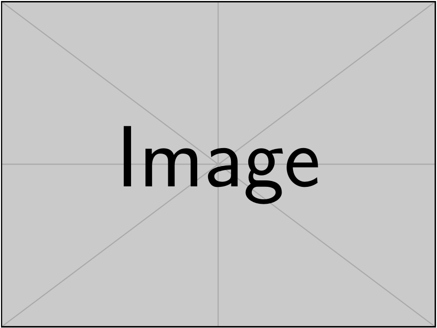

---
author:
- 'Paul Iacomi ^, ^'
- 'Someone Else ^, ^'
bibliography:
- refs/biblio.bib
title: This is the paper title
---

---
author:
    - Paul Iacomi:
        institute:
          - ICGM
        email: paul.iacomi@umontpellier.fr
        correspondence: "yes"
    - Someone Else:
        institute:
          - ICGM
institute:
  - ICGM:
        name: Institute Charles Gerhardt Montpellier (ICGM)
        address: Bat.15, Place Eugène Bataillon, 34095 Montpellier Cedex 5, France
project:
    title: project
link-citations: true
number-sections: true
xnos-capitalise: true
xnos-number-by-section: false
cref: false
---

Introduction
============

Herein we refer to a table ([1](#tbl:example-table){reference-type="ref"
reference="tbl:example-table"}), but also to a figure ([1](#fig:caption-1){reference-type="ref"
reference="fig:caption-1"}) or a latter equation
([\[eqn:example\]](#eqn:example){reference-type="ref" reference="eqn:example"}). Finally, figures
([2](#fig:caption-si){reference-type="ref" reference="fig:caption-si"}) from the SI can also be
referenced. We can add citations as well [@example]. Units are inserted with the help of `siunitx`.
We can have some standard data 40 kJ/mol or ranges such as 20 Å--30 Å. Finally simple unit
typesetting is also possible  MHz/kPa.

Chemistry is included by referring to the `mhchem` package. Simple molecules like $\ce{N2}$ and
$\ce{C2H4}$ should be easy to include. More complex formula typesetting is possible too:
$\ce{^{13}C}$ NMR, $\ce{CaCl2 * 12H2O}$ and $\ce{Fe^{II}Fe^{III}2O4}$.

Equations are in a standard Latex `equation` environment.

$$\label{eqn:example}
    e^{i\pi} + 1 = 0$$

Materials and methods
=====================

::: {#tbl:example-table}
                Head 1                 Head 2            Head 3
  ---------------------------------- ----------- -----------------------
              Content 1               Content 2      Long Content 2
              Content 4               Content 5   Even Longer Content 6
   \* Multicolmns are also possible              

  :  An example table, with caption on top.
:::

Results and discussion
======================

{#fig:caption-1
width="0.9\\linewidth"}

{width="0.9\\linewidth"}

Conclusions
===========

Acknowledgements {#acknowledgements .unnumbered}
================

Author contributions {#author-contributions .unnumbered}
====================

SI section 1
============

[@example]

{#fig:caption-si width="0.9\\linewidth"}

SI section 2
============

We are referring to previous [2](#fig:caption-si){reference-type="ref" reference="fig:caption-si"}.

References {#references .unnumbered}
==========
